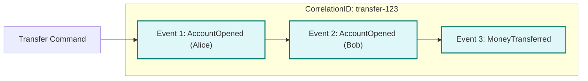

# Causation and Correlation in go-crablet

go-crablet tracks **causation** and **correlation** to help you understand the relationships between events in your system. This is essential for debugging, auditing, and understanding event flows.

## Understanding the Concepts

- **Causation ID**: Links events that are directly caused by each other (e.g., a command creates an event)
- **Correlation ID**: Groups related events that are part of the same logical operation (e.g., all events in a transaction)

## Event Sequence Example

Here's how causation and correlation work in a typical account operation:

```
┌─────────────────────────────────────────────────────────────────────────────┐
│                           Event Flow with IDs                               │
├─────────────────────────────────────────────────────────────────────────────┤
│                                                                             │
│  Command: "Transfer $100 from Alice to Bob"                                │
│  Correlation ID: transfer-123                                               │
│                                                                             │
│  ┌─────────────────┐    ┌─────────────────┐    ┌─────────────────┐         │
│  │ Event 1         │    │ Event 2         │    │ Event 3         │         │
│  │ Type: AccountOpened                                                     │
│  │ Position: 100   │    │ Type: AccountOpened                              │
│  │ Causation: -    │───▶│ Position: 101   │───▶│ Position: 102   │         │
│  │ Correlation:    │    │ Causation: 100  │    │ Causation: 101  │         │
│  │ transfer-123    │    │ Correlation:    │    │ Correlation:    │         │
│  └─────────────────┘    │ transfer-123    │    │ transfer-123    │         │
│                         └─────────────────┘    └─────────────────┘         │
│                                                                             │
│  ┌─────────────────┐                                                        │
│  │ Event 4         │                                                        │
│  │ Type: MoneyTransferred                                                   │
│  │ Position: 103   │                                                        │
│  │ Causation: 102  │                                                        │
│  │ Correlation:    │                                                        │
│  │ transfer-123    │                                                        │
│  └─────────────────┘                                                        │
│                                                                             │
│  Legend:                                                                   │
│  ───▶ Causation flow (Event A causes Event B)                             │
│  Correlation: All events share the same correlation ID                     │
└─────────────────────────────────────────────────────────────────────────────┘
```

## Code Example

For a complete working example of causation and correlation in the Account domain, see:

**[Transfer Example](examples/transfer/main.go)**: Complete implementation showing AccountOpened and MoneyTransferred events with causation and correlation IDs.

### Key Concepts in the Example:

```go
// Start a new operation with correlation ID
correlationID := "transfer-" + uuid.New().String()

// First event (no causation, starts the chain)
event1 := dcb.NewInputEvent("AccountOpened", dcb.NewTags("account_id", "acc1"), data1)
event1.CorrelationID = correlationID
// event1.CausationID is empty (first in chain)

// Second event (caused by first)
event2 := dcb.NewInputEvent("AccountOpened", dcb.NewTags("account_id", "acc2"), data2)
event2.CausationID = event1.ID  // Links to previous event
event2.CorrelationID = correlationID

// Third event (caused by second)
event3 := dcb.NewInputEvent("MoneyTransferred", dcb.NewTags("transfer_id", "transfer-123"), data3)
event3.CausationID = event2.ID  // Links to previous event
event3.CorrelationID = correlationID

// Append all events
store.Append(ctx, []dcb.InputEvent{event1, event2, event3}, nil)
```

**Event Types Used:**
- `AccountOpened`: When an account is created with initial balance and owner
- `MoneyTransferred`: When money is transferred between accounts (includes final balances)

## Reading Events with Causation/Correlation

```go
// Read events and examine their relationships
events, err := store.Read(ctx, query, nil)
if err != nil {
    log.Fatal(err)
}

for _, event := range events.Events {
    fmt.Printf("Event: %s (Position: %d)\n", event.Type, event.Position)
    fmt.Printf("  Causation ID: %s\n", event.CausationID)
    fmt.Printf("  Correlation ID: %s\n", event.CorrelationID)
    fmt.Printf("  Event ID: %s\n", event.ID)
    fmt.Println()
}
```

## Benefits

- **Debugging**: Trace exactly which event caused another
- **Auditing**: Group related events for compliance and reporting
- **Replay**: Understand the complete flow of operations
- **Monitoring**: Track performance and identify bottlenecks in event chains

## Best Practices

1. **Always set correlation IDs** for related events in the same operation
2. **Chain causation IDs** to show the direct cause-and-effect relationships
3. **Use meaningful correlation IDs** that help identify the operation (e.g., `transfer-123`, `account-456`)
4. **Keep causation chains short** - if an event chain gets too long, consider breaking it into smaller operations

## Event Relationships

### Causation Chain
```
Event A → Event B → Event C → Event D
   ↓         ↓         ↓         ↓
Causation  Causation  Causation  Causation
   ID        ID         ID         ID
   -        Event A   Event B   Event C
```

### Correlation Group
```
┌─────────────────────────────────────┐
│        Correlation ID: transfer-123 │
├─────────────────────────────────────┤
│ Event A │ Event B │ Event C │ Event D│
│ (causation: -) │ (causation: A) │ (causation: B) │ (causation: C) │
└─────────────────────────────────────┘
```

This pattern allows you to:
- Follow the exact sequence of events that led to a particular state
- Group all events related to a single business operation
- Debug complex event flows by tracing causation chains
- Audit complete operations by following correlation IDs 

## Simplified Pattern for Atomic Operations

When you append multiple events as part of a single atomic operation (i.e., a single `Append` call/transaction), you can simplify causation and correlation:

- **Correlation ID**: Set the same correlation ID for all events in the batch (e.g., the command or business process ID).
- **Causation ID**: Set the same causation ID for all events (e.g., the triggering command/event), or leave empty if the context is clear.
- **Chaining**: If you want to trace the exact sequence, you can chain causation IDs (each event points to the previous event's ID), but this is optional for atomic operations.

### Example: Simple Correlation and Causation

```go
correlationID := "transfer-" + uuid.New().String()
causationID := "cmd-xyz" // e.g., the command/request ID

for _, event := range []*dcb.InputEvent{&event1, &event2, &event3} {
    event.CorrelationID = correlationID
    event.CausationID = causationID
}
store.Append(ctx, []dcb.InputEvent{event1, event2, event3}, nil)
```

### Example: Chained Causation (Optional)

```go
event1.CausationID = causationID
// After appending, event1.ID will be set by the store
// For illustration, assume event1.ID = "evt-1"
event2.CausationID = event1.ID
// event2.ID = "evt-2"
event3.CausationID = event2.ID
// event3.ID = "evt-3"
```

## Visual: Chain of Events (Mermaid Diagram)



**Legend:**
- All events in the subgraph share the same correlation ID (e.g., `transfer-123`)
- Arrows represent causation (which event caused the next)
- For atomic operations, you may use a single causation ID for all, or chain them as shown above

## Account Domain Event Types

**Core Account Events:**
- `AccountOpened`: When an account is created with initial balance and owner
- `MoneyTransferred`: When money is transferred between accounts (includes final balances)

**Event Flow:**
1. **AccountOpened**: Creates accounts for Alice and Bob
2. **MoneyTransferred**: Transfers money between accounts with updated balances

All events share the same correlation ID (`transfer-123`) and are chained by causation IDs to show the logical flow of the account operations. 