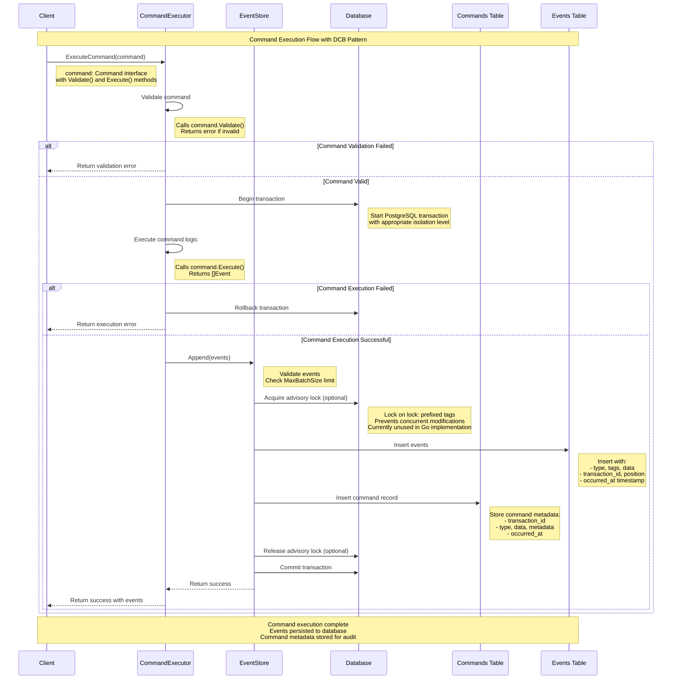

# Command Execution Flow

This document illustrates the command execution flow in go-crablet using a sequence diagram, showing how commands are processed, validated, and converted to events.

## Sequence Diagram



## Key Components

### 1. Command Interface
```go
type Command interface {
    Validate() error
    Execute() ([]Event, error)
}
```

### 2. CommandExecutor
- **Purpose**: High-level API for command execution
- **Responsibilities**:
  - Validate commands before execution
  - Manage database transactions
  - Handle rollback on failures
  - Convert commands to events via EventStore

### 3. EventStore
- **Purpose**: Core event sourcing operations
- **Responsibilities**:
  - Validate event batches
  - Manage advisory locks for consistency (optional feature)
  - Persist events to database
  - Store command metadata for audit trail

### 4. Database Operations
- **Transaction Management**: Ensures atomicity
- **Optimistic Locking**: Primary mechanism using transaction IDs and append conditions
- **Advisory Locks**: Optional additional locking via `lock:` prefixed tags (optional feature, currently unused)
- **Event Storage**: Persists events with metadata
- **Command Tracking**: Stores command execution history

## Flow Steps

1. **Command Validation**: Client provides command, CommandExecutor validates it
2. **Transaction Start**: Begin database transaction with appropriate isolation
3. **Command Execution**: Execute command logic to generate events
4. **Event Validation**: Check event batch size and structure
5. **Lock Acquisition**: Acquire advisory lock for transaction consistency (optional)
6. **Event Persistence**: Insert events into events table
7. **Command Tracking**: Store command metadata in commands table
8. **Lock Release**: Release advisory lock (optional)
9. **Transaction Commit**: Commit all changes atomically
10. **Response**: Return success/error to client

## Error Handling

- **Validation Errors**: Returned immediately without database operations
- **Execution Errors**: Trigger transaction rollback
- **Database Errors**: Automatic rollback with error details
- **Lock Timeouts**: Return specific timeout errors

## Benefits

- **Atomicity**: All operations succeed or fail together
- **Consistency**: Advisory locks prevent concurrent conflicts (optional feature)
- **Audit Trail**: Complete command and event history
- **Error Recovery**: Automatic rollback on failures
- **Performance**: Optimized for typical event sourcing workloads

## Example Usage

```go
// Create command
cmd := &EnrollStudentCommand{
    StudentID: "student-123",
    CourseID:  "course-456",
}

// Execute command
events, err := executor.ExecuteCommand(ctx, cmd)
if err != nil {
    // Handle error
    return err
}

// Events are now persisted and can be queried
fmt.Printf("Generated %d events\n", len(events))
```

This flow ensures reliable command execution with full audit trail and proper error handling, following the Dynamic Consistency Boundary (DCB) pattern principles.
