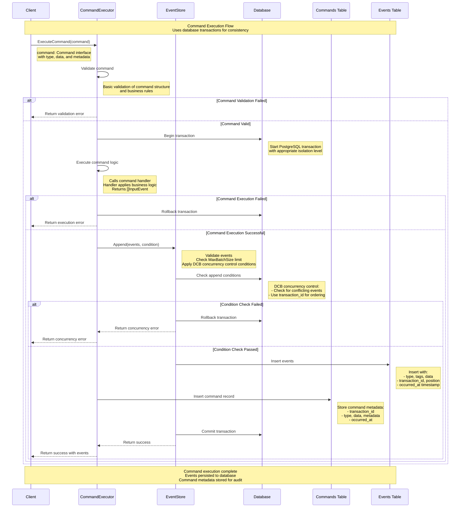

# Command Execution Flow

This document illustrates how commands are processed in go-crablet, showing the step-by-step flow from command submission to event generation and storage. The system uses database transactions to ensure data consistency and provides an audit trail of all command executions.

## Sequence Diagram



## Database Persistence Example

After successful command execution, the database contains:

### Events Table (Primary Data)
```sql
SELECT * FROM events WHERE transaction_id = 123 ORDER BY position;
```

| type | tags | data | transaction_id | position | occurred_at |
|------|------|------|----------------|----------|-------------|
| CourseOffered | {"course_id:CS101"} | {"course_id":"CS101","title":"Introduction to Computer Science","credits":3,"capacity":30} | 123 | 1 | 2024-01-15 10:30:00 |
| EnrollmentCompleted | {"student_id:student123","course_id:CS101"} | {"student_id":"student123","course_id":"CS101","grade":"A"} | 123 | 2 | 2024-01-15 10:30:00 |

### Commands Table (Audit Trail)
```sql
SELECT * FROM commands WHERE transaction_id = 123;
```

| transaction_id | type | data | metadata | occurred_at |
|----------------|------|------|----------|-------------|
| 123 | EnrollStudent | {"student_id":"student123","course_id":"CS101"} | {"user_id":"user456","session_id":"sess789"} | 2024-01-15 10:30:00 |

**Key Points:**
- **Same transaction_id**: Both events and command share transaction_id 123
- **Sequential positions**: Events are ordered by position (1, 2)
- **Database transaction**: All data persisted in single database transaction
- **Complete audit trail**: Command metadata preserved for debugging/auditing

## Key Components

### 1. Command Interface
```go
type Command interface {
    GetType() string
    GetData() []byte
    GetMetadata() map[string]interface{}
}
```

### 2. CommandExecutor
- **Purpose**: High-level API for organizing business logic execution (optional convenience layer)
- **Responsibilities**:
  - Execute commands using handlers
  - Manage database transactions
  - Handle rollback on failures
  - Execute command handlers to generate events
  - Store command metadata for audit trail

### 3. EventStore
- **Purpose**: Core event sourcing operations
- **Responsibilities**:
  - Validate event batches
  - Apply DCB concurrency control via append conditions
  - Persist events to database
  - **Does NOT store commands** (handled by CommandExecutor)

### 4. Database Operations
- **Transaction Management**: Ensures all operations succeed or fail together
- **DCB Concurrency Control**: Primary mechanism using transaction IDs and append conditions (not classic optimistic locking)

- **Event Storage**: Persists events with metadata
- **Command Tracking**: Stores command execution history (separate from EventStore)

## Flow Steps

1. **Command Validation**: Client provides command, basic validation performed
2. **Transaction Start**: Begin database transaction with appropriate isolation
3. **Command Execution**: Execute command handler to apply business logic and generate events
4. **Event Validation**: Check event batch size and structure
5. **DCB Condition Check**: Apply concurrency control via append conditions
6. **Event Persistence**: Insert events into events table
7. **Command Tracking**: Store command metadata in commands table (separate from EventStore)
8. **Transaction Commit**: Commit all changes atomically
9. **Response**: Return success/error to client

## Error Handling

- **Validation Errors**: Returned immediately without database operations
- **Execution Errors**: Trigger transaction rollback
- **Database Errors**: Automatic rollback with error details
- **Lock Timeouts**: Return specific timeout errors

## Benefits

- **Data Consistency**: All operations succeed or fail together using database transactions
- **DCB Consistency**: Concurrency control uses the DCB approach (not classic optimistic locking). We also introduced transaction_id (inspired by Oskar's article) to ensure correct event ordering. The DCB approach governs conflict detection and consistency, while transaction IDs provide a reliable, gapless ordering of events.
- **Audit Trail**: Complete command and event history
- **Error Recovery**: Automatic rollback on failures
- **Performance**: Optimized for typical event sourcing workloads
- **Simplicity**: No complex locking mechanisms - pure DCB approach


## Example Usage

```go
// Create command
cmd := dcb.NewCommand("EnrollStudent", []byte(`{"student_id": "student123", "course_id": "CS101"}`), nil)

// Execute command with handler
events, err := executor.ExecuteCommand(ctx, cmd, enrollHandler, nil)
if err != nil {
    // Handle error
    return err
}

// Events are now persisted and can be queried
fmt.Printf("Generated %d events\n", len(events))
```

This flow ensures reliable command execution with full audit trail and proper error handling, following the Dynamic Consistency Boundary (DCB) pattern principles with concurrency control via transaction IDs (not classic optimistic locking). The command handler applies business logic to decide what events to create - there is no automatic conversion from commands to events.

## References

- [Ordering in Postgres Outbox: Why Transaction IDs Matter](https://event-driven.io/en/ordering_in_postgres_outbox/)

