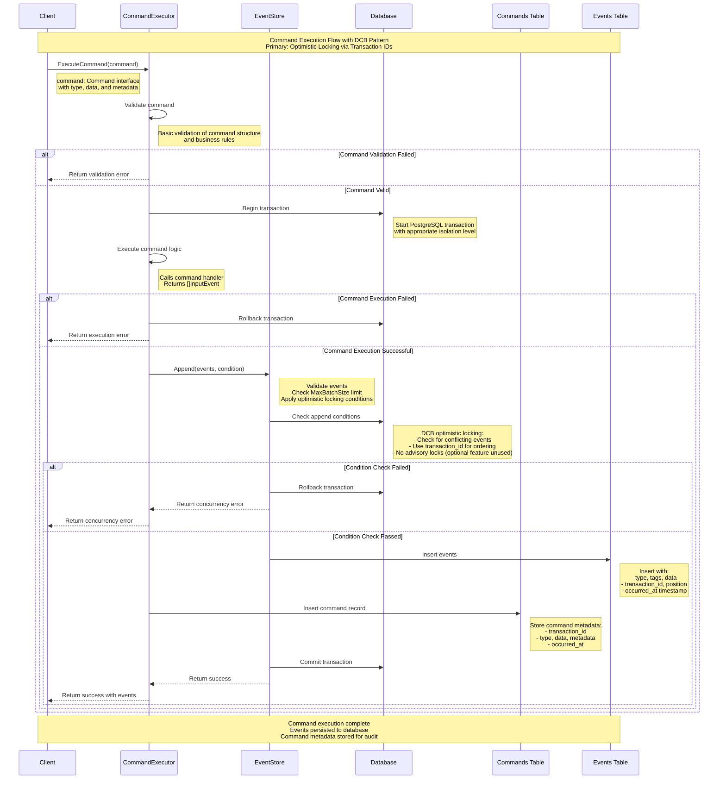

# Command Execution Flow

This document illustrates the command execution flow in go-crablet using a sequence diagram, showing how commands are processed, validated, and converted to events using the DCB pattern's optimistic locking approach.

## Sequence Diagram



## Key Components

### 1. Command Interface
```go
type Command interface {
    GetType() string
    GetData() []byte
    GetMetadata() map[string]interface{}
}
```

### 2. CommandExecutor
- **Purpose**: High-level API for command execution (optional convenience layer)
- **Responsibilities**:
  - Execute commands using handlers
  - Manage database transactions
  - Handle rollback on failures
  - Convert commands to events via EventStore
  - Store command metadata for audit trail

### 3. EventStore
- **Purpose**: Core event sourcing operations
- **Responsibilities**:
  - Validate event batches
  - Apply DCB optimistic locking via append conditions
  - Persist events to database
  - **Does NOT store commands** (handled by CommandExecutor)

### 4. Database Operations
- **Transaction Management**: Ensures atomicity
- **DCB Optimistic Locking**: Primary mechanism using transaction IDs and append conditions
- **Advisory Locks**: Optional feature via `lock:` prefixed tags (currently unused in Go implementation)
- **Event Storage**: Persists events with metadata
- **Command Tracking**: Stores command execution history (separate from EventStore)

## Flow Steps

1. **Command Validation**: Client provides command, basic validation performed
2. **Transaction Start**: Begin database transaction with appropriate isolation
3. **Command Execution**: Execute command handler to generate events
4. **Event Validation**: Check event batch size and structure
5. **DCB Condition Check**: Apply optimistic locking via append conditions (no advisory locks)
6. **Event Persistence**: Insert events into events table
7. **Command Tracking**: Store command metadata in commands table (separate from EventStore)
8. **Transaction Commit**: Commit all changes atomically
9. **Response**: Return success/error to client

## Error Handling

- **Validation Errors**: Returned immediately without database operations
- **Execution Errors**: Trigger transaction rollback
- **Database Errors**: Automatic rollback with error details
- **Lock Timeouts**: Return specific timeout errors

## Benefits

- **Atomicity**: All operations succeed or fail together
- **DCB Consistency**: Optimistic locking via transaction IDs prevents concurrent conflicts
- **Audit Trail**: Complete command and event history
- **Error Recovery**: Automatic rollback on failures
- **Performance**: Optimized for typical event sourcing workloads
- **Simplicity**: No complex locking mechanisms - pure optimistic approach

## Example Usage

```go
// Create command
cmd := dcb.NewCommand("EnrollStudent", []byte(`{"student_id": "123", "course_id": "456"}`), nil)

// Execute command with handler
events, err := executor.ExecuteCommand(ctx, cmd, enrollHandler, nil)
if err != nil {
    // Handle error
    return err
}

// Events are now persisted and can be queried
fmt.Printf("Generated %d events\n", len(events))
```

This flow ensures reliable command execution with full audit trail and proper error handling, following the Dynamic Consistency Boundary (DCB) pattern principles with optimistic locking via transaction IDs.
